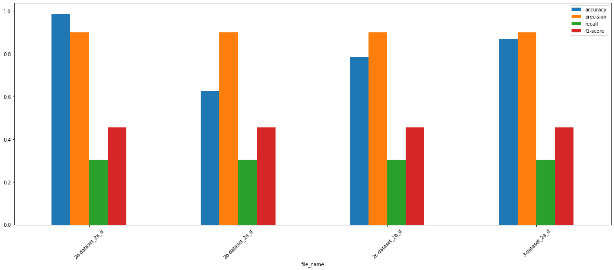

# Humor Detection: An application of LSTM on jokes.
Alexandra Pacuraru (10354511) and Paul Codrea (10353564)

## Description:

Our Natural Language Understanding project aims to classify whether a piece of text is funny or not. We implemented a sequence classification task using a model that follows a Long Short Term Memory (LSTM) architecture, and a second model that follows a Random Forest architecture. The datasets used for this task have been scraped from Reddit. Our initial aim was to detect funny jokes from unfunny jokes using LSTM. This was further developed by experimenting with different types of input embeddings and introducing the Random Forest model to use to compare the models’ results. 

The funny jokes were scraped from r/DadJokes from Reddit and unfunny jokes from r/BadJokes. We then decided to include natural text, scraped from r/ScienceFacts, inherently not aimed to be humorous, to see how it affects our model’s accuracy. While processing the collection of jokes, we arbitrarily chose a threshold based on the number of Reddit upvotes, to select pieces of text that are regarded as more “funny”. We also experimented with various ways of pre-processing, which can be controlled through a set of hyperparameters.

We performed experiments that compare the models trained on datasets that include funny jokes and unfunny jokes with models trained on datasets comprised of funny jokes and scientific facts. Our experiments also enabled us to detect what pre-processing methods enhance our model’s performance, by including datasets with different pre-processing steps.

The project contains 4 models: 3 LSTM models with 3 different embedding methods, and a Random Forest Model.

** Our full code, with previous commits, can be seen on GitHub as well, here: ** [https://github.com/paulcodrea/reddit_humor](https://github.com/paulcodrea/reddit_humor).

## Contents:

The project includes:

- A script that is used to scrape the datasets from Reddit and pre-process it. It is located in the **notebooks** directory.
- 4 models: 3 LSTM with word-id, tf-IDF and word2vec embeddings, and a Random Forest model. The files are located in the **models’** directory, as well as an LSTM template document.
- The code used to run the experiments and the findings. It is located in the **experiments** directory.
- A live demo script that loads the best performing models and takes an input from the user and predicts if the input is funny or not. The input is run on four scenarios, one best model for each specific embedding. The file is located in the **scripts** directory.

## How to run it:

- Our package requirements can be found in the requirements.txt file. The Python environment can record a list of dependencies. If you want to install the dependencies in a virtual environment, install the requirements as follows:
    
    ```bash
    # Run in your shell.
    pip install -r requirements.txt
    ```
    
- Our scripts and models don’t require any input and are saved as Jupyter Notebook files. Slight adjustments might be needed for leading the data set step if the project is pulled from GitLab (where the data is not stored), not Google Drive (where our data is stored).
- In order to run the experiments, simply run the **experiments.ipynb** file in Google Colab and enter an input (we’re sorry if our model doesn’t find your joke is not as funny as you thought it is!)

## Datasets:

The datasets have been scraped from Reddit. Since the pages scraped are constantly updated by their communities, re-running the scripts to generate new datasets and running the experiments might produce slight variations in the outputs.

The four datasets used for the experiments are as follows:

1. The dataset contains Dadjokes, and BadJokes (no stopwords and case folding) - (1a).
2. The dataset contains Dadjokes, and BadJokes (with stopwords and case folding)- (1b).
3. The dataset contains Dadjokes, and facts (no stopwords and no case folding) - (2a).
4. The dataset contains Dadjokes, and facts (with stopwords and case folding) - (2b).

**Datasets can be viewed in Google Drive:** [https://drive.google.com/drive/folders/191Hjql3_Meszp6L5jiHgMDXLdg8VrTwG?usp=sharing](https://drive.google.com/drive/folders/191Hjql3_Meszp6L5jiHgMDXLdg8VrTwG?usp=sharing)

**Sources**:

Our project aims at comparing our findings with the “Humor Detection: A Transformer Gets the Last Laugh” by Orion Weller and Kevin Seppi (2019) paper. We also researched related work in the humour detection task and used certain definitions and suggestions from the papers when creating our data sets (such as concatenating the text and the punch line).

Our models were trained by us and were implemented using:

- word2vec (for LSTM embeddings).
- Random Forest Classifier.
- Keras Tenserflow LSTM.
- Keras tokeniser for processing steps.

**Other Links**:

Since our trained models and datasets are large, we stored them in a Drive folder which can be accessed here: [https://drive.google.com/drive/folders/1eGTbXnVwG77LTX7M28eD617K2CLfEc7W?usp=sharing](https://drive.google.com/drive/folders/1eGTbXnVwG77LTX7M28eD617K2CLfEc7W?usp=sharing)

- Trained models: [https://drive.google.com/drive/folders/14LcXeadNVO9yvmlvVCXdE8ISu3mKY6Bt?usp=sharing](https://drive.google.com/drive/folders/14LcXeadNVO9yvmlvVCXdE8ISu3mKY6Bt?usp=sharing)
- Datasets: [https://drive.google.com/drive/folders/191Hjql3_Meszp6L5jiHgMDXLdg8VrTwG?usp=sharing](https://drive.google.com/drive/folders/191Hjql3_Meszp6L5jiHgMDXLdg8VrTwG?usp=sharing)

## Training Hyperparameters

For consistency, the following hyperparameters and training splits have been used in all three LSTM models.

| epochs        | 3        |
|---------------|----------|
| batch_size    | 70       |
|---------------|----------|
| LSTM          | [50, 10] |
|---------------|----------|
| Dropout       |      0.5 |
|---------------|----------|
| Activation    |  sigmoid |
|---------------|----------|
| learning_rate | 0.001    |
|---------------|----------|
| train_p       | 0.7      |
|---------------|----------|
| test_p        | 0.2      |
|---------------|----------|
| val_p         | 0.1      |

## Results

The project attempts to compare the accuracy of four models trained on different types of datasets and outline the benefits and limitations of the models. As it can be seen in the following table, the LSTM model trained on word_id embeddings, tf-IDF, and Random Forest model performed the best (having the highest accuracy) trained on dataset '2a' (The dataset contains Dadjokes, and facts - no stopwords and no case folding). However, the LSTM model trained on word2vec embeddings performed the best trained on dataset '2b' (The dataset contains Dadjokes, and facts - with stopwords and case folding). 

**Accuracy of four models, trained on four different datasets**. For consistency the training, testing and validation splits are the same for all models.
| Model | 2a_word_id | 2b_tf_idf | 2c_word2vec | random_forest |
|-------|------------|-----------|-------------|---------------|
| 1a    | 82         | 59.02     | 59.76       | 66.09         |
| 1b    | 75.44      | 55.78     | 53.89       | 60.42         |
| 2a    | 98.8       | 62.56     | 65.92       | 86.81         |
| 2b    | 97.53      | 49.76     | 78.45       | 85.51         |

The following figure depicts only the four highest performing models, in comparison. The plot shows for each model, the accuracy, precision, recall and f1-score. 




## References

1. Weller, O. and Seppi, K. (2019). Humor detection: A transformer gets the last laugh. Proceedings of the 2019 Conference on Empirical Methods in Natural Language Processing.
